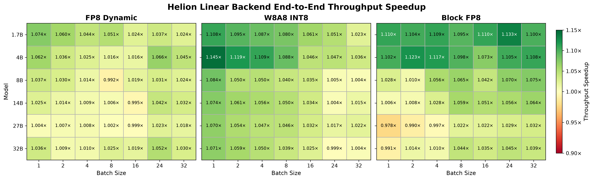

<!-- markdownlint-disable MD001 MD041 -->
<p align="center">
  <picture>
    <source media="(prefers-color-scheme: dark)" srcset="https://raw.githubusercontent.com/vllm-project/vllm/main/docs/assets/logos/vllm-logo-text-dark.png">
    
  </picture>
</p>

<h3 align="center">
Easy, fast, and cheap LLM serving for everyone
</h3>

<p align="center">
| <a href="https://docs.vllm.ai"><b>Documentation</b></a> | <a href="https://blog.vllm.ai/"><b>Blog</b></a> | <a href="https://arxiv.org/abs/2309.06180"><b>Paper</b></a> | <a href="https://x.com/vllm_project"><b>Twitter/X</b></a> | <a href="https://discuss.vllm.ai"><b>User Forum</b></a> | <a href="https://slack.vllm.ai"><b>Developer Slack</b></a> |
</p>

🔥 We have built a vLLM website to help you get started with vLLM. Please visit [vllm.ai](https://vllm.ai) to learn more.
For events, please visit [vllm.ai/events](https://vllm.ai/events) to join us.

---

## About

This fork contains vLLM Helion integration and kernel work that has not yet been upstreamed to the main vLLM repository.

## Installation

Some changes in this fork modify C++ kernels and have not yet been upstreamed. As a result, `VLLM_USE_PRECOMPILED` is not sufficient, and vLLM must be built from source.

Follow the vLLM development installation instructions: <https://docs.vllm.ai/en/latest/contributing/#developing>.

## Helion Linear Backend

### Prerequisites

- [Helion](https://github.com/pytorch/helion) installed with the required [commit](https://github.com/pytorch/helion/pull/3452) included.
- An NVIDIA Hopper GPU, such as H100.

### Quickstart

Use `--linear-backend helion` to enable the Helion linear backend:

```bash
vllm serve \
    --model Qwen/Qwen3.8-27B-FP8 \
    --max-num-seqs 32 \
    --tensor-parallel-size 1 \
    --linear-backend helion
```

### Supported Quantization Formats

The Helion linear backend currently supports the following quantization formats:

- **FP8_Dynamic**: FP8 per-token activation and per-channel weight scaling. e.g., [AzatAI/Qwen3.8-27B-FP8-dynamic](https://huggingface.co/AzatAI/Qwen3.8-27B-FP8-dynamic).
- **W8A8_INT8**: INT8 per-token activation and per-channel weight scaling. e.g., [Freaksterz/Qwen3.8-27B-SmoothQuant-W8A8-INT8](https://huggingface.co/Freaksterz/Qwen3.8-27B-SmoothQuant-W8A8-INT8).
- **Block_FP8**: FP8 with 1×128 activation scaling and 128×128 weight scaling. Uses `HelionFP8BlockScaledMMLinearKernel`. e.g., [Qwen/Qwen3.8-27B-FP8](https://huggingface.co/Qwen/Qwen3.8-27B-FP8).

### Quantized GEMM Kernels

The Helion linear backend uses the following quantized GEMM kernels:

- [`scaled_mm`](vllm/kernels/helion/ops/scaled_mm.py): used for **FP8_Dynamic** and **W8A8_INT8** quantization formats
- [`block_scaled_mm`](vllm/kernels/helion/ops/block_scaled_mm.py): used for **Block_FP8** quantization format

### Benchmark

End-to-end throughput speedup of the Helion linear backend over the default backend on an H100, across models and batch sizes for each supported quantization format:



### Pretuned Configs

Pretuned configs for the [`scaled_mm`](vllm/kernels/helion/ops/scaled_mm.py) and [`block_scaled_mm`](vllm/kernels/helion/ops/block_scaled_mm.py) kernels on H100 are stored in:

- [`vllm/kernels/helion/configs/scaled_mm/nvidia_h100_80gb_hbm3.json`](vllm/kernels/helion/configs/scaled_mm/nvidia_h100_80gb_hbm3.json)
- [`vllm/kernels/helion/configs/block_scaled_mm/nvidia_h100_80gb_hbm3.json`](vllm/kernels/helion/configs/block_scaled_mm/nvidia_h100_80gb_hbm3.json)

The shipped configs cover the following models:

- Qwen/Qwen3.8-27B
- Qwen/Qwen3-1.7B
- Qwen/Qwen3-4B
- Qwen/Qwen3-8B
- Qwen/Qwen3-14B
- Qwen/Qwen3-32B

### Autotuning

For models not covered by the shipped pretuned configs, the vLLM server will fail to start when the Helion linear backend is enabled. Users must run AOT autotuning to generate configs for their specific workloads.

#### Identify Missing Configs

Start the vLLM server with `VLLM_HELION_LINEAR_SKIP_CONFIG_CHECK=1`:

```bash
VLLM_HELION_LINEAR_SKIP_CONFIG_CHECK=1 vllm serve \
    --model Qwen/Qwen3.8-27B-FP8 \
    --max-num-seqs 32 \
    --tensor-parallel-size 1 \
    --linear-backend helion
```

This bypasses the config coverage check, allowing the server to run with the closest available configs. Warning messages will identify shapes for which pretuned configs are missing.

For example:

> Helion scaled_mm has no pre-tuned config for weight shape (K=2048, N=12288) with in_dtype=torch.float8_e4m3fn at M=[1, 2, 4, 8, 16, 24, 32]. Running anyway with the closest available config.

#### Update the Kernel Input Generator

Update `generate_inputs` for the corresponding quantized GEMM kernel to include the missing shapes reported in the warning logs:

- [`scaled_mm`](vllm/kernels/helion/ops/scaled_mm.py): used for **FP8_Dynamic** and **W8A8_INT8** quantization formats
- [`block_scaled_mm`](vllm/kernels/helion/ops/block_scaled_mm.py): used for **Block_FP8** quantization format

#### Run AOT Autotuning

Run the Helion autotuning script to generate optimized configs:

```bash
HELION_BENCHMARK_CUDAGRAPH=1 \
python scripts/autotune_helion_kernels.py \
    --kernels scaled_mm block_scaled_mm \
    --autotune-effort "full"
```

Full autotuning can take several hours, depending on the number of input shapes.

When an LLM provider is available, LLM-assisted autotuning is also recommended to improve the search process. For example, with AWS Bedrock, after configuring the required AWS credentials:

```bash
HELION_LLM_PROVIDER=bedrock \
HELION_LLM_MODEL=us.anthropic.claude-opus-4-8 \
HELION_AUTOTUNER=LLMSeededLFBOTreeSearch \
HELION_BENCHMARK_CUDAGRAPH=1 \
python scripts/autotune_helion_kernels.py \
    --kernels scaled_mm block_scaled_mm \
    --autotune-effort "full"
```

## Feedback and Contact

### Helion linear backend

For questions, issues, or feedback about the Helion linear backend, please leave a comment on the vLLM Helion linear backend [RFC](https://github.com/vllm-project/vllm/issues/46526).

**Contributors**: [@xiaohongchen1991](https://github.com/xiaohongchen1991), [@yushangdi](https://github.com/yushangdi)

### Helion General

For general Helion questions and discussions, join us in the #helion channel on the [GPU MODE Discord](https://discord.gg/gpumode).
